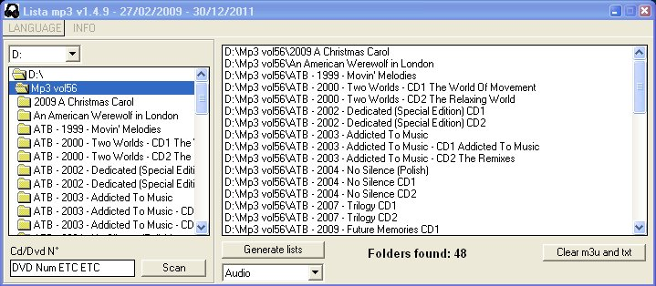



## Lista Mp3

### Description

CRATE LIST MP3,WMA,MID,MP1,MP2,MOD,OGG,M4A,AVI,ASF, MPE,MPEG,MPG,MOV,WMV,MP4,FLAC(New), GBA, NDS(rar, zip, 7z), Programs list MULTI LANGUAGE

Create m3u list in each folder

Txt Create list of all the mp3 in the folder selected with attached album titles by copy of folder names."Solved the problem of sub-directories and Folders Read-Only".Also create only text files NINTENDO and file VIDEO and Programs folders.

Crea lista m3u in ogni cartella

Crea lista txt di tutti gli mp3 contenuti nella cartella selezionata con annessi titoli album tramite copia dei nomi delle cartelle. Crea anche solo file di testo lista VIDEO e NINTENDO e Programmi(Solo prima cartella).

"Risolto il problema delle sottocartelle"
 
### More Info
 

             |
---                |---
**Submitted On**   |2009-02-16 16:55:28
**By**             |[Ganzaborn](https://github.com/Planet-Source-Code/PSCIndex/blob/master/ByAuthor/ganzaborn.md)
**Level**          |Advanced
**User Rating**    |3.3 (13 globes from 4 users)
**Compatibility**  |VB 6\.0
**Category**       |[Files/ File Controls/ Input/ Output](https://github.com/Planet-Source-Code/PSCIndex/blob/master/ByCategory/files-file-controls-input-output__1-3.md)
**World**          |[Visual Basic](https://github.com/Planet-Source-Code/PSCIndex/blob/master/ByWorld/visual-basic.md)
**Archive File**   |[Lista\_Mp32220532252012\.zip](https://github.com/Planet-Source-Code/ganzaborn-lista-mp3__1-71878/archive/master.zip)

